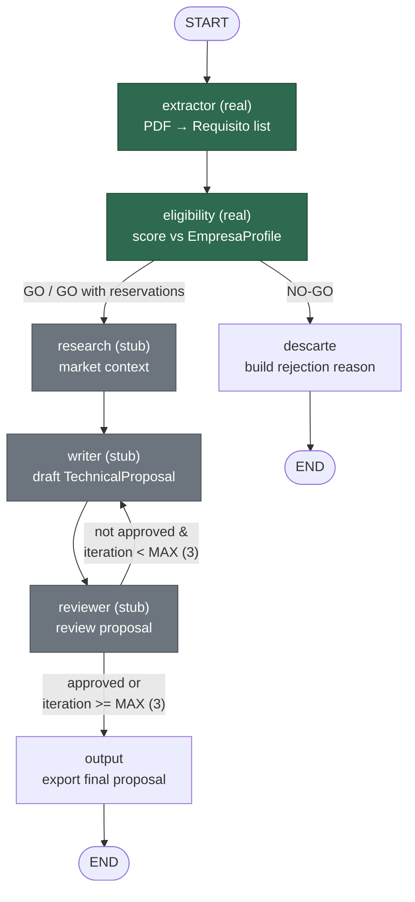

# Bid Intelligence Agent

> **Status: in active development (Phase 1).** Architecture and agents are
> still evolving — expect breaking changes.

## Goal

A multi-agent system, built with [LangGraph](https://github.com/langchain-ai/langgraph),
that automates the analysis of Spanish public procurement tender documents
(*pliegos* / *memorias justificativas*) for architecture and engineering
companies.

Given a tender PDF and a company profile, the system aims to:

1. **Extract** every relevant requirement from the tender document
   (technical, economic, time-related, documentation, and award criteria).
2. **Assess eligibility**: score the company's fit against those
   requirements and produce a GO / NO-GO / GO-with-reservations
   recommendation with critical gaps highlighted.
3. **Research** additional context needed for the bid.
4. **Draft** a technical proposal.
5. **Review** the draft and loop back for revisions until it meets a quality
   bar (or a max number of iterations is reached).

The end goal is to help a bidding company quickly decide whether a tender is
worth pursuing, and to accelerate drafting a competitive proposal.

## Architecture

The system is built as a [LangGraph](https://github.com/langchain-ai/langgraph)
state graph: a shared `BidState` flows through five agent nodes, two
conditional edges control routing (early exit on NO-GO, and a Writer ↔
Reviewer revision loop capped at `MAX_ITERACIONES`).



## Roadmap

The project is built in 4 phases, ordered by technical dependencies — each
with a working, demoable deliverable.

| Phase | Focus | Deliverable |
|---|---|---|
| **1. LangGraph + Pydantic** (current) | Full graph with all 5 agents, GPT-4o everywhere, no fine-tuning yet | End-to-end flow on a real tender PDF, with shared state, conditional edges, and a working Writer ↔ Reviewer revision loop |
| **2. MCP integrations** (future) | Web MCP (Brave Search), Notion MCP, Git MCP | Research Agent searches the web in real time; the final proposal is auto-exported to Notion and versioned via Git |
| **3. Fine-tuning** (future) | QLoRA fine-tuned LLaMA 3.2 for the Extractor Agent, deployed on Modal, replacing GPT-4o | Accuracy/cost benchmark of the fine-tuned model vs. the GPT-4o baseline |
| **4. UI & observability** (future) | FastAPI backend + lightweight HTML/JS frontend, streaming the LangGraph run live (pipeline diagram lighting up node by node via SSE/WebSocket); LangSmith tracing | Recordable end-to-end demo |

## Current state (Phase 1)

| Agent | Status |
|---|---|
| `extractor.py` | **Real** — reads the PDF with PyMuPDF, splits it into overlapping fragments, and extracts typed `Requisito` items via GPT-4o (`with_structured_output`), then consolidates/deduplicates the result. |
| `eligibility.py` | **Real** — GPT-4o scores the full list of `Requisito` against the company's `EmpresaProfile` and returns a `ScoringResult` (GO / NO-GO / GO with reservations, critical gaps, justification). |
| `research.py`, `writer.py`, `reviewer.py` | **Stubs** — hardcoded placeholder output, marked with `FASE` comments in the code. |
| `graph.py`, `state.py`, `main.py` | Working end-to-end, orchestrating the two real agents plus the stubs. |

Planned next steps: convert the remaining stub agents to real GPT-4o calls
following the same pattern used in `eligibility.py`.

## Setup

```bash
python -m venv .venv
source .venv/bin/activate
pip install -r requirements.txt
cp .env.example .env   # then fill in your OPENAI_API_KEY
```

## Running

```bash
python main.py
```

This runs the full pipeline against the sample tender in
`pruebas/Memoria Justificativa Concesion de Obras.pdf` for two example
company profiles (one expected to pass eligibility, one expected to fail).

## Testing the Extractor

`pruebas/test_extractor_variance.py` runs the extractor agent standalone and
dumps the raw and consolidated requirements to JSON, useful for checking
consistency across runs on the same document.
